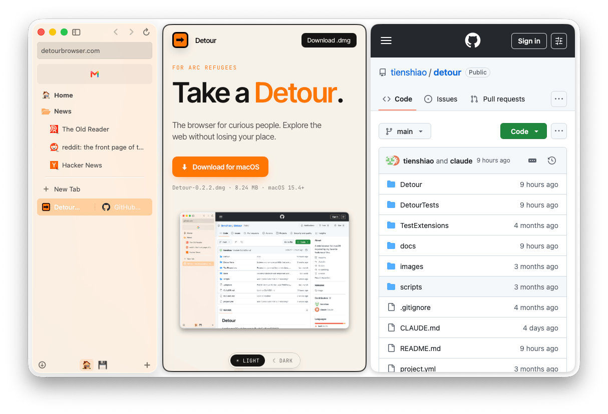

# Detour

A native macOS web browser built with Swift and WebKit.

<picture>
  <source media="(prefers-color-scheme: dark)" srcset="images/detour-split-dark.png">
  
</picture>

## Features

- **Spaces** — Organize tabs into color-coded workspaces, each with isolated cookies and storage. Each space has a name, emoji, and color.
- **Profiles** — Create and manage multiple browser profiles, each with their own settings and extensions.
- **Tab Pinning** — Pin frequently used tabs to the top of the sidebar. Pinned tabs reset to their home URL instead of closing.
- **Pinned Folders** — Organize pinned tabs into folders for better grouping.
- **Tab Archiving** — Automatically archive inactive tabs to keep the sidebar tidy.
- **Split Tabs** — View two tabs side by side as a single sidebar row. Create by dragging a tab onto the edge of another tab or of the content area, or by Option-clicking a link. Resizable panes, animated formation/separation, and splits survive pinning.
- **Favorites** — Bookmark pages for quick access.
- **Command Palette** — Cmd+T for new tab, Cmd+L to navigate. Searches open tabs, browsing history (FTS5), and web suggestions in one unified input, with frecency-based autocomplete and a top-hit row.
- **Downloads** — Built-in download manager with progress tracking, cancel, reveal in Finder, and persistence across sessions.
- **Content Blocker** — Built-in ad and tracker blocking with EasyList support and per-site whitelist management.
- **Peek Preview** — Long-click links to preview them in an overlay without leaving the current page. Expand to open in a new tab.
- **Audio Controls** — Detects tabs playing audio and shows a mute toggle per tab.
- **Link Status Bar** — Hovering over a link shows the destination URL at the bottom of the window.
- **Find in Page** — Cmd+F with match counting and prev/next navigation.
- **Multi-Window** — Each window tracks its own active space. WebView ownership transfers automatically on window focus; inactive windows show tab snapshots.
- **Incognito** — Private browsing with non-persistent data stores. No history recorded. Cleaned up on window close.
- **Session Restore** — Tabs persist across launches with full scroll position and form state via WebKit interaction state archiving.
- **Tab Management** — Drag-and-drop reordering, close tabs, reopen recently closed tabs (Cmd+Shift+T).
- **Sidebar Auto-Hide** — Toggle sidebar visibility with Cmd+S; auto-hide mode reopens on edge hover.
- **Context Menus** — Right-click links to open in a new tab or new window.
- **Web Inspector** — Cmd+Option+I to open developer tools.
- **Auto-Updates** — Automatic update checking and installation via Sparkle.
- **Web Extensions** *(WIP)* — Browser extension support including CRX installation, permissions, popups, and native messaging.

## Requirements

- macOS 15.4+
- Xcode with Swift 5.10
- [XcodeGen](https://github.com/yonaskolb/XcodeGen)

## Getting Started

```bash
# Generate the Xcode project
xcodegen generate

# Build
xcodebuild -scheme Detour -configuration Debug build

# Run tests
xcodebuild -scheme DetourTests -configuration Debug test
```

Or open `Detour.xcodeproj` in Xcode after running `xcodegen generate`.

## Dependencies

- [GRDB.swift](https://github.com/groue/GRDB.swift) — SQLite database for session and history storage
- [Sparkle](https://github.com/sparkle-project/Sparkle) — Framework for automatic app updates
